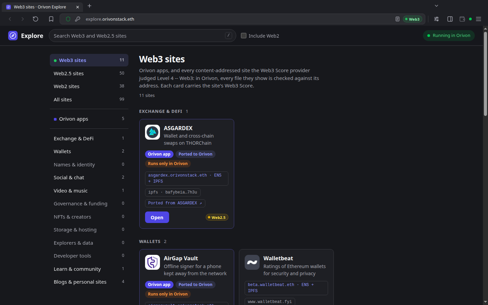
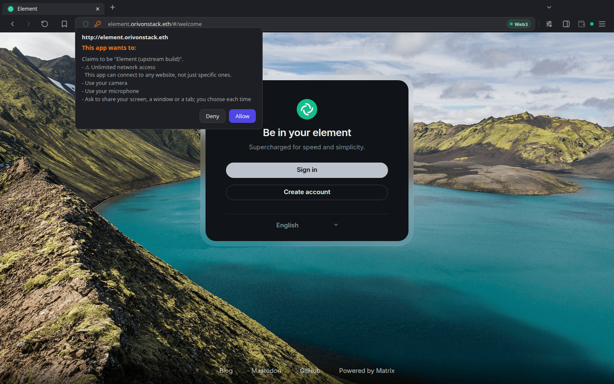
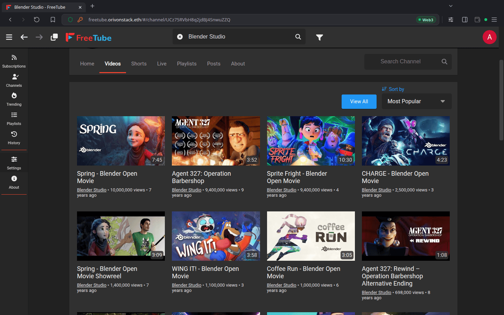
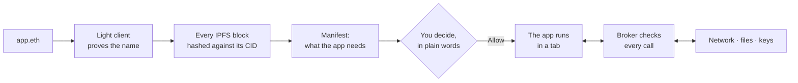

<div align="center">


# Orivon

### Web3. Trustless. On-the-fly.<br>Pick all three.

**Open a link, and a desktop app, a peer-to-peer client or a whole Node.js server runs in your tab,<br>
verified on your machine and holding only the powers you grant it.**<br>
No installer. No app store. No account. No server of ours.

[](https://github.com/OrivonBrowser/orivon-mvp/releases/latest)
[](docs/known-limitations.md)
[](LICENSE)
[](#download)
[](https://github.com/OrivonBrowser/orivon-mvp/actions/workflows/ci.yml)

**[Download](#download)** · [Website](https://www.orivonstack.com) · [Docs](https://docs.orivonstack.com) · [Discord](https://discord.gg/DuRg87MvgD) · [X](https://x.com/OrivonBrowser) · [Telegram](https://t.me/OrivonBrowser)

<br>



</div>

<br>

## The web forbids what Web3 needs

A web page cannot open a socket, join a peer-to-peer network, check a blockchain or keep a file on
your disk. That is the browser's sandbox doing its job, and it is why every decentralised protocol
ends up behind a middleman:

- the "decentralised" app at a `.com` is found through a registrar's DNS and served from a company's
  server;
- the chain is read through an RPC provider you never chose, and IPFS through a gateway that sees
  every byte and could change it;
- anything that needs a real socket becomes a download: a binary to install, update and trust on
  faith.

**The protocol is decentralised. The road to it is not.**

Orivon takes the veto away from the browser and gives the decision to you. An app is still a web
page at a link. It declares what it needs, you grant it in plain words, and Orivon enforces that on
every call. Names and content are proven on your machine instead of taken on a server's word.

## What you get

<table>
<tr>
<td width="50%" valign="top">

### 🔗 Desktop apps, from a link

FreeTube, Element and The Lounge run in a tab from a `.eth` name: upstream code, **unmodified**,
with no installer, no fork and no native helper. The Lounge's own Node.js server runs right
inside the tab.

</td>
<td width="50%" valign="top">

### 🔑 Every power is yours to grant

An app lists what it needs. You read it in plain words, such as *"connect to any computer on the
internet"*, and decide. Whatever an app did not declare it can never get, not even from you.

</td>
</tr>
<tr>
<td valign="top">

### 🛡️ Verified, not trusted

`.eth` names are proven by a light client running on your machine, and every IPFS block is hashed
against its CID. Servers deliver the bytes, and none of them is believed.

</td>
<td valign="top">

### 📊 A Web3 Score on every site

A shield in the address bar says what you are on: plain Web2, content you can verify, or open and
trustless. The levels come from a score provider you choose, never from Orivon by decree.

</td>
</tr>
<tr>
<td valign="top">

### 🧱 Native code only as WebAssembly

Node addons load as WebAssembly, spawned programs run as WASI, and their sockets and files pass
through the same grants. Nothing an app ships runs as machine code on your system.

</td>
<td valign="top">

### 🏠 No Orivon server

No account, no cloud, no sync service: your keys and data stay on your machine. Usage statistics
only if you say yes. Copyleft under the AGPL, so it stays that way.

</td>
</tr>
</table>

## Open these in Orivon

Every one of these is a real app, published to IPFS and named on Ethereum.

| App | Address | What it shows |
|---|---|---|
| **FreeTube** | [`freetube.orivonstack.eth`](https://freetube.orivonstack.eth.limo) | The private YouTube desktop client, running in a tab |
| **Element** | [`element.orivonstack.eth`](https://element.orivonstack.eth.limo) | The end-to-end encrypted Matrix chat client, with nothing to install |
| **The Lounge** | [`thelounge.orivonstack.eth`](https://thelounge.orivonstack.eth.limo) | An IRC client whose own Node.js server (Express, Socket.IO, SQLite) runs inside your tab and reaches any IRC network |
| **AirGap Vault** | [`airgapvault.orivonstack.eth`](https://airgapvault.orivonstack.eth.limo) | AirGap's secret storage for offline signing, opened from a link |
| **ASGARDEX** | [`asgardex.orivonstack.eth`](https://asgardex.orivonstack.eth.limo) | The THORChain wallet and cross-chain swap client |
| **Orivon Explore** | [`explore.orivonstack.eth`](https://explore.orivonstack.eth.limo) | A directory of Web3 sites, each with its Web3 Score |

In another browser these links go through the eth.limo gateway, and the app says it needs Orivon.
In Orivon the same link opens as the real `.eth` name, proven on your machine. The ports are alpha
software: keep funds you cannot afford to lose out of the wallets for now.

<table>
<tr>
<td width="50%"></td>
<td width="50%"></td>
</tr>
<tr>
<td align="center"><sub>One question, in plain words, before an app runs</sub></td>
<td align="center"><sub>Then it runs as its desktop version did</sub></td>
</tr>
</table>

## Your everyday browser, too

Orivon is built to be lived in, not opened only when you need a dapp.

| | |
|---|---|
| 🛑 **Full uBlock Origin** | The complete MV2 extension with blocking `webRequest`, the version Chrome no longer runs. uBlock Origin Lite and other MV3 blockers work as well |
| 🧩 **Chrome extensions** | Install from the Chrome Web Store, a `.crx` or `.zip`, or a folder. Popups, side panels, keyboard shortcuts and DevTools panels work |
| 🕶️ **Profiles and private windows** | Each profile is a separate browser with its own data. A private window keeps nothing and sends no statistics |
| 🗂️ **Tabs that scale** | Groups, split view, pinning, tab search, idle tabs put to sleep, tear-off with a live preview, and session restore |
| 🔒 **Privacy controls** | Global Privacy Control on by default, third-party cookie blocking, Do Not Track, HTTPS-only, DNS over HTTPS, and pop-ups blocked unless you clicked |
| 🧰 **Everything else you expect** | A password manager in your OS keyring, bookmarks and history imported from Chrome, Edge, Brave or Firefox, reader view, printing to PDF, screenshots, screen sharing and picture-in-picture |
| 🐧 **Linux first** | Native on X11 and Wayland, with packages for Windows and macOS |

## How it works



1. **The name is proven.** A `.eth` name is resolved by [Helios](https://github.com/a16z/helios), an
   Ethereum light client that runs on your machine from a checkpoint shipped with each release. No
   RPC provider is trusted to tell the truth.
2. **The content is checked.** Every IPFS block is hashed against its CID before it is used.
   Gateways are trusted to deliver bytes, never to be right about them. A server can refuse to
   answer; it cannot hand you a wrong byte unnoticed.
3. **The app says what it wants.** Its manifest declares each capability: which hosts it may reach,
   whether it may listen, keep files or sign with a key. The bundle is hash-pinned and cached, so
   later visits run from your disk.
4. **You decide, once.** One prompt, in words a person reads. The grant belongs to that app's origin
   and nobody else's, and the address bar lets you switch any of it off.
5. **The broker enforces it.** Every socket, file and signature passes through Orivon's capability
   broker and is checked against what you granted, on every call.

### Know what you are touching: the Web3 Score

| Level | What it means | Mark |
|:---:|---|:---:|
| 1 | A standard website | Web2 |
| 2 | The site publishes a hash of its files (DDOC), so you can check you got exactly what its owner published | Web2.5 |
| 3 | Its code is open source and runs nothing external without your informed consent | Web2.5 |
| 4 | Trustless in its operations and connections | Web3 |

Levels 1 and 2 are measured by your own machine. Levels 3 and 4 are judged by the score provider you
pick in Settings, and a lookup names a group of sites rather than the one you are on. Orivon's own
provider is the default, and you can choose another or none.

## For developers

Write an ordinary web frontend. Add a manifest at `/.well-known/orivon.json`:

```json
{
  "orivonApiVersion": 0,
  "id": "chat.example.irc",
  "name": "My IRC client",
  "version": "1.0.0",
  "entry": "index.html",
  "capabilities": {
    "net": { "https": { "connect": ["irc.libera.chat:6697"] } }
  }
}
```

Then use what you declared:

```js
const irc = await orivon.net.connectSecure({ host: 'irc.libera.chat', port: 6697 })
const out = irc.writable.getWriter()
await out.write(new TextEncoder().encode('NICK satoshi\r\nUSER satoshi 0 * :satoshi\r\n'))
```

Already have a Node.js or Electron app? Keep using `net`, `tls`, `dgram`, `fs`, `http`,
`child_process`, `worker_threads` and `node:sqlite`: Orivon's Node layer maps them onto the same
capabilities. [orivon-ports](https://github.com/OrivonBrowser/orivon-ports) holds the recipes
that turn upstream FreeTube, Element, The Lounge, AirGap Vault and ASGARDEX into Orivon apps
without forking them.

### The idea underneath

The part of Orivon built to last is the interface apps are written against:
[`src/contracts/`](src/contracts/), the whole `orivon.*` surface as TypeScript types with no
implementation in them. Today `orivon.net.connect()` reaches a socket in Electron's main process.
The interface is designed so that what sits underneath it can change without an app written
against it changing a line. Read those files first if you want to know what Orivon is;
[`ARCHITECTURE.md`](ARCHITECTURE.md) explains how they fit together.

## Download

| | Package |
|---|---|
| 🐧 **Linux** | `.deb` for Debian and Ubuntu, AppImage for any distribution (x64) |
| 🪟 **Windows** | Installer for x64: per user, no administrator needed |
| 🍎 **macOS** | `.dmg` for Apple silicon and for Intel |

**[Get the latest release →](https://github.com/OrivonBrowser/orivon-mvp/releases/latest)**

Every release is also published on IPFS, and its `ipfs://` address is in the release notes. The
Windows and macOS packages are not signed with a bought certificate, so each system warns once
before the first run ([what to click](docs/known-limitations.md#packages)).

### Run from source

```bash
git clone https://github.com/OrivonBrowser/orivon-mvp.git
cd orivon-mvp
npm install
npm start         # your real profile, as an installed build
# npm run dev     # hot reload, on a throwaway profile each launch
```

You need Node.js 22.13 or newer and nothing else: no compiler, on any system. A check fails the
build if any dependency would need one. [`docs/development/setup.md`](docs/development/setup.md)
has the details.

## Roadmap

**Built**

- [x] A full browser shell: tabs, profiles, private windows, Chrome extensions
- [x] The capability broker: per-app grants, enforced on network, TLS, files, keys and media
- [x] A Node.js layer: `net`, `tls`, `dgram`, `fs`, `http`, `child_process`, `worker_threads`, `sqlite`
- [x] The app loader: discovery, hash-pinned cache, one plain-words prompt, DDOC
- [x] `.eth` names and `ipfs://` / `ipns://` content, verified on your machine
- [x] The Web3 Score, with providers you choose
- [x] Packages for Linux, Windows and macOS, each release also on IPFS

**Not built yet**

- [ ] A wallet. An app can hold a signing key Orivon derives for it, with no funds and no seed
      phrase; holding and sending crypto comes later, under its own security model
- [ ] A developer mode in the UI for loading an unpacked app, and an app store
- [ ] DDOC anchored in DNS, and Arweave as a second delivery path
- [ ] Identity export and backup
- [ ] Signed Windows and macOS installers

**Further out:** Tor and proxy chains · a WebAssembly runtime that contains untrusted apps · mobile ·
Web3 search · cross-device sync.

The goal that runs through all of it: any Web3 codebase, from a full node to a DEX to a Tor proxy,
running as a site the moment you open its name. [docs.orivonstack.com](https://docs.orivonstack.com)
describes that vision; [`docs/scope.md`](docs/scope.md) says what this version holds.

## Documentation

| | |
|---|---|
| [Known limitations](docs/known-limitations.md) | What Orivon does not do yet, and what each server it talks to can see |
| [`ARCHITECTURE.md`](ARCHITECTURE.md) | How the pieces fit, in five minutes |
| [`docs/README.md`](docs/README.md) | The documentation index |
| [Compatibility matrix](docs/planning/compatibility-matrix.md) | What a ported app can rely on, row by row |
| [`CHANGELOG.md`](CHANGELOG.md) | What each release changed |

## Community

- 💬 [Discord](https://discord.gg/DuRg87MvgD): the main community, for questions and contributors
- 🐦 [X](https://x.com/OrivonBrowser): news
- ✈️ [Telegram](https://t.me/OrivonBrowser): support and discussion

[`CONTRIBUTING.md`](CONTRIBUTING.md) covers setup and how a change gets merged. Report a security
issue privately, as [`SECURITY.md`](SECURITY.md) describes, never in a public issue.

## Licence

[AGPL-3.0-only](LICENSE). Copyright (C) 2026 Davide Martinico.

Use it, fork it, build on it. If you distribute a modified version, or let others use one over a
network, its complete source goes out under the same licence. [`vendor/`](vendor/) holds
third-party code under its own licences, beside each package: GPL-3.0, MIT and BSD-3-Clause.
